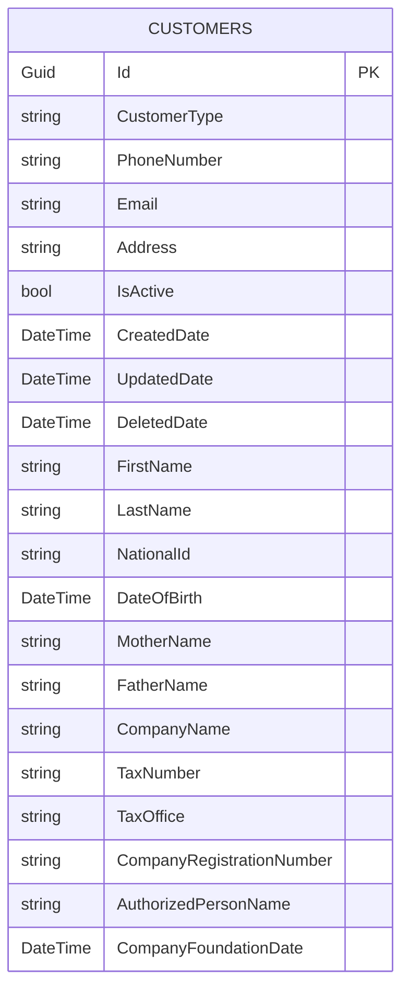

# 🏦 Banking Credit System

Modern bankacılık sektörü için geliştirilmiş, **Clean Architecture** ve **CQRS** pattern'leri kullanılarak oluşturulmuş bir kredilendirme sistemidir.

## 🔥 **SOLID Prensipleri Compliance (YENİ!)**

Bu proje **SOLID prensipleri**ne tam uyumlu olarak geliştirilmiştir:

### ✅ **Interface Segregation Principle (ISP)**
```csharp
// Büyük interface yerine küçük, spesifik interface'ler
IQueryRepository<TEntity, TId>      // Sadece Query operasyonları
ICommandRepository<TEntity, TId>    // Sadece Command operasyonları  
IAggregationRepository<TEntity, TId> // Sadece Aggregation operasyonları
IPaginationRepository<TEntity, TId>  // Sadece Pagination operasyonları

// Composed interface
IRepository<TEntity, TId> : IQueryRepository, ICommandRepository, IAggregationRepository, IPaginationRepository
```

### ✅ **Single Responsibility Principle (SRP)**
```csharp
// Her sınıf tek sorumluluğa sahip
IndividualCustomerValidator        // Sadece domain validation
IndividualCustomerExistenceChecker // Sadece existence checks
IndividualCustomerBusinessRules    // Orchestration
```

### ✅ **Open/Closed Principle (OCP)**
- Generic Repository pattern ile extensibility
- Entity inheritance hierarchy
- CQRS pattern ile query/command separation

### ✅ **Liskov Substitution Principle (LSP)**
- Customer hierarchy (IndividualCustomer, CorporateCustomer)
- Repository implementations

### ✅ **Dependency Inversion Principle (DIP)**
- Interface'ler Application katmanında
- Implementasyonlar Persistence katmanında
- Clean Architecture dependency flow

### ✅ **Exception Handling Sistemi**
- Global exception yakalama middleware'i
- RFC 7807 standardına uygun ProblemDetails yanıtları
- Özel exception tipleri (Business, Validation, Authorization, NotFound)
- FluentValidation entegrasyonu

---

## 🛠️ **Teknoloji Stack**

| Kategori | Teknoloji | Versiyon |
|----------|-----------|----------|
| **Framework** | .NET Core | 9.0 |
| **Language** | C# | 12.0 |
| **Architecture** | Clean Architecture | ✅ |
| **Pattern** | CQRS | ✅ |
| **ORM** | Entity Framework Core | 9.0.0 |
| **Database** | SQL Server | ✅ |
| **Validation** | FluentValidation | 12.0.0 |
| **Mapping** | AutoMapper | 14.0.0 |
| **Mediator** | MediatR | 12.5.0 |
| **API** | ASP.NET Core Web API | 9.0 |
| **Documentation** | Swagger/OpenAPI | ✅ |

---

## 🏗️ **Mimari Yapı**

### Clean Architecture Layers
```
┌─────────────────────────────────────────────┐
│                  WebApi                     │ ← Presentation Layer
├─────────────────────────────────────────────┤
│                Persistence                  │ ← Infrastructure Layer
├─────────────────────────────────────────────┤
│               Application                   │ ← Application Layer (CQRS)
├─────────────────────────────────────────────┤
│                 Domain                      │ ← Domain Layer
├─────────────────────────────────────────────┤
│                  Core                       │ ← Core Layer (Shared)
└─────────────────────────────────────────────┘
```

### Katman Bağımlılıkları
```
WebApi ──→ Application ──→ Domain ──→ Core
   │            │             │
   │            │             └──→ Core
   │            └──→ Core
   │
   └──→ Persistence ──→ Application & Core
```

---

## 📁 Proje Yapısı

```
BankingApp.CreditSystem/
├── BankingApp.CreditSystem.sln              ← Solution dosyası
├── BankingApp.CreditSystem.Core/            ← Core Katmanı (ISP Uyumlu!)
│   ├── Repositories/
│   │   ├── Entity.cs                        ← Base Entity sınıfı (Generic, Protected Constructor)
│   │   ├── IQueryRepository.cs              ← Query-only operations (ISP)
│   │   ├── ICommandRepository.cs            ← Command-only operations (ISP)
│   │   ├── IAggregationRepository.cs        ← Aggregation-only operations (ISP)
│   │   ├── IPaginationRepository.cs         ← Pagination-only operations (ISP)
│   │   ├── IRepository.cs                   ← Composed Repository Interface (ISP compliant)
│   │   └── PagedResult.cs                   ← Sayfalama sonuç modeli
│   ├── CrossCuttingConcerns/
│   │   └── Exceptions/                      ← Exception handling sistemi
│   │       ├── Types/                       ← Özel exception tipleri
│   │       ├── HttpProblemDetails/          ← RFC 7807 uyumlu ProblemDetails sınıfları
│   │       ├── Handlers/                    ← Exception handler'lar
│   │       └── Middlewares/                 ← Global exception middleware
│   └── BankingApp.CreditSystem.Core.csproj
├── BankingApp.CreditSystem.Domain/          ← Domain Katmanı (İş Kuralları)
│   ├── Entities/                            ← Concrete entity'ler
│   │   ├── Customer.cs                      ← Base müşteri sınıfı (Entity<Guid>)
│   │   ├── IndividualCustomer.cs            ← Bireysel müşteri
│   │   └── CorporateCustomer.cs             ← Kurumsal müşteri
│   └── BankingApp.CreditSystem.Domain.csproj
├── BankingApp.CreditSystem.Application/     ← Application Katmanı (SRP Uyumlu!)
│   ├── Features/                            ← CQRS Features
│   │   ├── IndividualCustomers/
│   │   │   ├── Commands/CreateIndividualCustomer/
│   │   │   ├── Queries/GetIndividualCustomerById/
│   │   │   ├── Validators/                  ← Domain Validation (SRP!)
│   │   │   ├── Services/                    ← Business Services (SRP!)
│   │   │   └── Rules/                       ← Orchestration
│   │   └── CorporateCustomers/
│   │       ├── Commands/CreateCorporateCustomer/
│   │       ├── Validators/                  ← Domain Validation (SRP!)
│   │       ├── Services/                    ← Business Services (SRP!)
│   │       └── Rules/                       ← Orchestration
│   ├── Services/
│   │   └── Repositories/                    ← Repository Interface'leri
│   ├── ServiceRegistration.cs               ← Application DI registration
│   └── BankingApp.CreditSystem.Application.csproj
├── BankingApp.CreditSystem.Persistence/     ← Persistence Katmanı (Veritabanı)
│   ├── Contexts/
│   │   └── BankingContext.cs                ← DbContext (TPH yaklaşımı)
│   ├── Repositories/                        ← Repository Implementations
│   │   ├── EfRepository.cs                  ← Generic EF Core implementasyonu
│   │   ├── CustomerRepository.cs            ← Customer repository impl
│   │   ├── IndividualCustomerRepository.cs  ← Individual customer repository impl
│   │   └── CorporateCustomerRepository.cs   ← Corporate customer repository impl
│   ├── ServiceRegistration.cs               ← DI Container registration
│   └── BankingApp.CreditSystem.Persistence.csproj
└── BankingApp.CreditSystem.WebApi/          ← WebApi Katmanı (Presentation)
    └── BankingApp.CreditSystem.WebApi.csproj
```

---

## 🚀 **Başlangıç**

### Gereksinimler
- **.NET 9.0 SDK**
- **SQL Server** (LocalDB desteklenir)
- **Visual Studio 2022** veya **Visual Studio Code**

### Kurulum

1. **Repository'yi klonlayın:**
   ```bash
   git clone https://github.com/karacalibt/BankingApp-CreditSystem.git
   cd BankingApp-CreditSystem
   ```

2. **Bağımlılıkları yükleyin:**
   ```bash
   dotnet restore
   ```

3. **Projeyi build edin:**
   ```bash
   dotnet build
   ```

4. **Veritabanını oluşturun (gelecekte):**
   ```bash
   dotnet ef database update --project BankingApp.CreditSystem.Persistence
   ```

5. **API'yi çalıştırın:**
   ```bash
   dotnet run --project BankingApp.CreditSystem.WebApi
   ```

---

## 📊 **CQRS Pattern Kullanımı**

### Command Örneği (Müşteri Oluşturma)
```csharp
// Command (Request)
public class CreateIndividualCustomerCommand : IRequest<IndividualCustomerDto>
{
    public string FirstName { get; set; }
    public string LastName { get; set; }
    public string NationalId { get; set; }
    public DateTime DateOfBirth { get; set; }
    // ... diğer özellikler
}

// Handler (Business Logic) - SRP Uyumlu!
public class CreateIndividualCustomerCommandHandler : IRequestHandler<CreateIndividualCustomerCommand, IndividualCustomerDto>
{
    public async Task<IndividualCustomerDto> Handle(CreateIndividualCustomerCommand request, CancellationToken cancellationToken)
    {
        // Improved SRP-compliant business rules validation
        await _businessRules.ValidateCreateRequestAsync(request);
        
        // Entity creation
        var customer = new IndividualCustomer { ... };
        var createdCustomer = await _repository.AddAsync(customer);
        
        return _mapper.Map<IndividualCustomerDto>(createdCustomer);
    }
}

// Validation (FluentValidation)
public class CreateIndividualCustomerCommandValidator : AbstractValidator<CreateIndividualCustomerCommand>
{
    public CreateIndividualCustomerCommandValidator()
    {
        RuleFor(x => x.FirstName).NotEmpty().MaximumLength(100);
        RuleFor(x => x.NationalId).NotEmpty().Length(11).Must(BeNumeric);
        // ... diğer kurallar
    }
}
```

### Query Örneği (Müşteri Sorgulama)
```csharp
// Query (Request)
public class GetIndividualCustomerByIdQuery : IRequest<IndividualCustomerDto?>
{
    public Guid Id { get; set; }
}

// Handler (Data Retrieval)
public class GetIndividualCustomerByIdQueryHandler : IRequestHandler<GetIndividualCustomerByIdQuery, IndividualCustomerDto?>
{
    public async Task<IndividualCustomerDto?> Handle(GetIndividualCustomerByIdQuery request, CancellationToken cancellationToken)
    {
        var customer = await _repository.GetByIdAsync(request.Id, cancellationToken);
        return customer == null ? null : _mapper.Map<IndividualCustomerDto>(customer);
    }
}
```

### Controller Kullanımı (Gelecek WebAPI implementasyonu)
```csharp
[ApiController]
[Route("api/[controller]")]
public class IndividualCustomersController : ControllerBase
{
    private readonly IMediator _mediator;

    [HttpPost]
    public async Task<ActionResult<IndividualCustomerDto>> Create(CreateIndividualCustomerCommand command)
    {
        var result = await _mediator.Send(command);
        return Created($"/api/individualcustomers/{result.Id}", result);
    }

    [HttpGet("{id}")]
    public async Task<ActionResult<IndividualCustomerDto>> GetById(Guid id)
    {
        var result = await _mediator.Send(new GetIndividualCustomerByIdQuery(id));
        return result == null ? NotFound() : Ok(result);
    }
}
```

### 🏗️ Features-Based Organization

Projede **Vertical Slice Architecture** kullanılmıştır:

```
Features/
├── IndividualCustomers/
│   ├── Commands/CreateIndividualCustomer/    ← Müşteri oluşturma
│   ├── Queries/GetIndividualCustomerById/    ← Müşteri sorgulama
│   ├── Constants/                            ← Sabit değerler
│   ├── Profiles/                             ← AutoMapper mappings
│   ├── Validators/                           ← Domain validation (SRP!)
│   ├── Services/                             ← Business services (SRP!)
│   └── Rules/                                ← Business rules orchestration
└── CorporateCustomers/
    └── ... (benzer yapı)
```

## 🗄️ Veritabanı Yapısı

Bu projede **Table Per Hierarchy (TPH)** yaklaşımı kullanılmaktadır. Tüm customer türleri tek tabloda saklanır ve bir discriminator kolonu ile ayırt edilir.

### 📋 Customers Tablosu (TPH)
```sql
Customers (Table Per Hierarchy)
├── Id (Guid, PK) - NEWID() default
├── CustomerType (nvarchar, Discriminator) - "Individual" / "Corporate"
├── PhoneNumber (nvarchar(20), Unique Index)
├── Email (nvarchar(255), Unique Index)
├── Address (nvarchar(500))
├── IsActive (bit, Default: true)
├── CreatedDate (datetime2, Default: GETUTCDATE())
├── UpdatedDate (datetime2, nullable)
├── DeletedDate (datetime2, nullable)
├── -- Individual Customer Fields --
├── FirstName (nvarchar(100))
├── LastName (nvarchar(100))
├── NationalId (nvarchar(11), Unique Index)
├── DateOfBirth (datetime2)
├── MotherName (nvarchar(200), nullable)
├── FatherName (nvarchar(200), nullable)
├── -- Corporate Customer Fields --
├── CompanyName (nvarchar(300))
├── TaxNumber (nvarchar(10), Unique Index)
├── TaxOffice (nvarchar(200))
├── CompanyRegistrationNumber (nvarchar(20), Unique Index)
├── AuthorizedPersonName (nvarchar(200))
└── CompanyFoundationDate (datetime2)
```

### 📊 Entity Relationship


---

## 🔧 **Geliştirme Notları**

### Business Rules (SOLID Uyumlu!)
```csharp
// SRP: Her sınıf tek sorumluluğa sahip
public class IndividualCustomerValidator
{
    public void ValidateNationalId(string nationalId) { /* TC Kimlik algoritması */ }
    public void ValidateAge(DateTime dateOfBirth) { /* Yaş kontrolü */ }
}

public class IndividualCustomerExistenceChecker
{
    public async Task CheckIfNationalIdExistsAsync(string nationalId) { /* DB kontrolü */ }
    public async Task CheckIfEmailExistsAsync(string email) { /* DB kontrolü */ }
}

public class IndividualCustomerBusinessRules
{
    // Orchestration - diğer sınıfları koordine eder
    public async Task ValidateCreateRequestAsync(CreateIndividualCustomerCommand request)
    {
        _validator.ValidateNationalId(request.NationalId);
        _validator.ValidateAge(request.DateOfBirth);
        await _existenceChecker.CheckIfNationalIdExistsAsync(request.NationalId);
        await _existenceChecker.CheckIfEmailExistsAsync(request.Email);
    }
}
```

### Repository Pattern (ISP Uyumlu!)
```csharp
// ISP: Interface'ler küçük ve spesifik
public interface IQueryRepository<TEntity, TId> where TEntity : Entity<TId>
{
    IQueryable<TEntity> Query();
    Task<TEntity?> GetByIdAsync(TId id);
    Task<IList<TEntity>> GetListAsync(Expression<Func<TEntity, bool>>? predicate = null);
}

public interface ICommandRepository<TEntity, TId> where TEntity : Entity<TId>
{
    TEntity Add(TEntity entity);
    TEntity Update(TEntity entity);
    void Delete(TEntity entity);
    Task<int> SaveChangesAsync();
}

// Composed interface
public interface IRepository<TEntity, TId> : 
    IQueryRepository<TEntity, TId>, 
    ICommandRepository<TEntity, TId>,
    IAggregationRepository<TEntity, TId>,
    IPaginationRepository<TEntity, TId>
    where TEntity : Entity<TId>
{
}
```

### Validation Rules
- **TC Kimlik No:** 11 haneli, algoritmik kontrol
- **Vergi No:** 10 haneli, Türkiye algoritması
- **Yaş Kontrolü:** 18-100 yaş arası (bireysel), 1-200 yıl (kurumsal)
- **Email/Telefon:** Uniqueness kontrolü

---

## 🔄 **Exception Handling Sistemi**

Bu projede kapsamlı bir exception handling sistemi uygulanmıştır:

```
CrossCuttingConcerns/Exceptions/
├── Types/                           ← Özel exception tipleri
│   ├── BusinessException.cs         ← İş kuralı ihlalleri
│   ├── ValidationException.cs       ← Validasyon hataları (FluentValidation)
│   ├── AuthorizationException.cs    ← Yetkilendirme hataları
│   └── NotFoundException.cs         ← Kaynak bulunamadı hataları
├── HttpProblemDetails/              ← RFC 7807 uyumlu ProblemDetails sınıfları
│   ├── BusinessProblemDetails.cs    ← 400 Bad Request
│   ├── ValidationProblemDetails.cs  ← 400 Bad Request (validasyon hataları listesi)
│   ├── AuthorizationProblemDetails.cs ← 401 Unauthorized
│   ├── NotFoundProblemDetails.cs    ← 404 Not Found
│   └── InternalServerErrorProblemDetails.cs ← 500 Internal Server Error
├── Handlers/                        ← Exception handler'lar
│   ├── ExceptionHandler.cs          ← Abstract base handler
│   └── HttpExceptionHandler.cs      ← HTTP yanıtları için concrete handler
└── Middlewares/                     ← Global exception middleware
    ├── ExceptionMiddleware.cs       ← Middleware implementasyonu
    └── ExceptionMiddlewareExtensions.cs ← Extension metodu
```

### Kullanım Örneği

```csharp
// Business Rules içinde exception fırlatma
public class IndividualCustomerBusinessRules
{
    public async Task CheckIfNationalIdExistsAsync(string nationalId)
    {
        var exists = await _repository.AnyAsync(x => x.NationalId == nationalId);
        if (exists)
            throw new BusinessException("Bu TC Kimlik numarası ile kayıtlı müşteri bulunmaktadır.");
    }
}

// WebAPI Startup'da middleware'i eklemek için
public void Configure(IApplicationBuilder app)
{
    // ... diğer middleware'ler
    app.UseCustomExceptionMiddleware(); // Global exception handling
    // ... diğer middleware'ler
}
```

---

## 🏁 **Proje Durumu**

| Kategori | Tamamlanma | Açıklama |
|----------|------------|----------|
| **Core Katmanı** | %100 | ISP uyumlu interface'ler ✅ |
| **Domain Katmanı** | %100 | Entity hierarchy ✅ |
| **Application Katmanı** | %80 | SRP uyumlu business rules ✅ |
| **Persistence Katmanı** | %90 | Repository implementations ✅ |
| **WebApi Katmanı** | %0 | Henüz başlanmadı |
| **SOLID Compliance** | %100 | Tüm prensipler uygulandı ✅ |
| **Exception Handling** | %100 | Global exception middleware ✅ |

**Genel Tamamlanma:** %43 (56/130 görev)

---

## 🤝 **Katkıda Bulunma**

1. Fork yapın
2. Feature branch oluşturun (`git checkout -b feature/amazing-feature`)
3. Değişikliklerinizi commit edin (`git commit -m 'feat: Add amazing feature'`)
4. Branch'inizi push edin (`git push origin feature/amazing-feature`)
5. Pull Request oluşturun

---

## 📝 **Lisans**

Bu proje MIT lisansı altında lisanslanmıştır. Detaylar için [LICENSE](LICENSE) dosyasına bakın.

---

## 👨‍💻 **Geliştirici**

**Bekir Tokgöz**
- GitHub: [@karacalibt](https://github.com/karacalibt)
- Email: [email@example.com](mailto:email@example.com)

---

## 🎯 **Gelecek Planları**

- [ ] WebAPI katmanının tamamlanması
- [ ] Authentication & Authorization
- [ ] Unit & Integration testleri
- [ ] Docker containerization
- [ ] Kredi skoru algoritması
- [ ] Risk değerlendirme sistemi
- [ ] Real-time notifications

---

*Bu proje Clean Architecture, CQRS, ve SOLID prensipleri kullanılarak modern .NET 9 teknolojileri ile geliştirilmiştir.* 